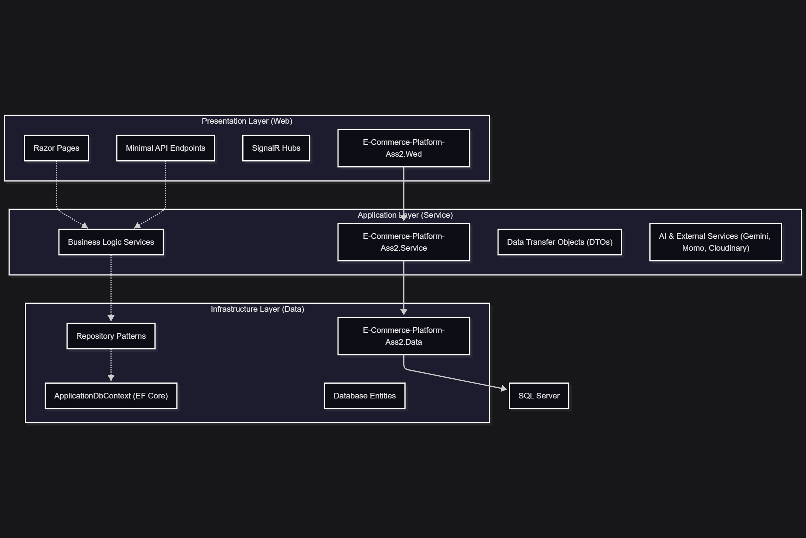
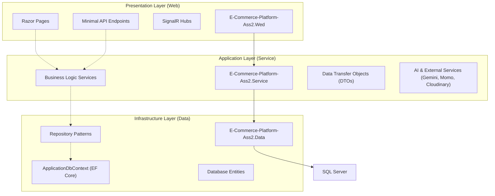

# E-Commerce Platform Ass2



## Overview

This project is a robust, feature-rich e-commerce platform built using modern Web technologies. It follows a clean 3-layer architecture to ensure scalability, maintainability, and clear separation of concerns.

## Key Features

- **AI Personal Shopper**: Integrated AI service (via Gemini) to assist users with product recommendations and queries.
- **Payment Integration**: Supports multiple payment gateways including Momo and VNPT eKYC for secure transactions.
- **Real-time Notifications**: Uses SignalR for live updates and chat functionality.
- **Background Jobs**: Automated tasks like AI chat fallback workers to ensure system reliability.
- **Comprehensive Management**: Admin and Shop management interfaces for overseeing products, orders, and reviews.

## Technology Stack

- **Framework**: .NET Core 9.0 (ASP.NET Core Razor Pages)
- **Database**: SQL Server with Entity Framework Core
- **Real-time**: SignalR
- **AI**: Google Gemini API
- **Payments**: Momo API, VNPT eKYC
- **Cloud Services**: Cloudinary for image management

## System Architecture

The system is designed with a standard 3-layer architecture:



### Layer Descriptions

1.  **Presentation Layer (`E-Commerce-Platform-Ass2.Wed`)**:
    - Handles the user interface using Razor Pages.
    - Manages real-time communication via SignalR Hubs (Notification, Chat).
    - Provides Minimal API endpoints for specific AI features.
    - Handles authentication and authorization.

2.  **Application/Service Layer (`E-Commerce-Platform-Ass2.Service`)**:
    - Contains the core business logic of the application.
    - Integrates with external APIs (Gemini for AI, Momo for payments).
    - Handles data mapping between entities and DTOs.
    - Contains background workers for asynchronous tasks.

3.  **Infrastructure/Data Layer (`E-Commerce-Platform-Ass2.Data`)**:
    - Manages data persistence using Entity Framework Core.
    - Implements the Repository pattern for data access abstraction.
    - Defines the database schema and entities.
    - Handles database migrations.

## Getting Started

1.  Configure the `appsettings.json` in the `Wed` project with your connection strings and API keys.
2.  Apply migrations using `dotnet ef database update`.
3.  Run the project using `dotnet run`.

## 1. Kiến trúc tổng thể

Hệ thống được xây dựng theo mô hình phân tầng (Layered Architecture):

- **UI Layer (E-Commerce-Platform-Ass2.Wed):**
  - Giao diện người dùng sử dụng Razor Pages, xử lý request/response, xác thực, phân quyền, session, layout, component, static files.
  - Kết nối SignalR Hub để nhận/gửi thông báo real-time.
  - Giao tiếp với tầng Service để lấy dữ liệu, thực hiện nghiệp vụ.
- **Service Layer (E-Commerce-Platform-Ass2.Service):**
  - Chứa toàn bộ business logic, xử lý nghiệp vụ (quản lý sản phẩm, đơn hàng, ví, đánh giá, đổi trả, ...).
  - Định nghĩa các DTO, helper, validate dữ liệu, mapping giữa entity và DTO.
  - Giao tiếp với tầng Repository để truy xuất dữ liệu.
  - Tích hợp các dịch vụ ngoài (Momo, Cloudinary, VNPT eKYC) qua các service chuyên biệt.
- **Repository/Data Layer (E-Commerce-Platform-Ass2.Data):**
  - Chứa các entity, repository, migration, context, truy vấn dữ liệu với Entity Framework Core.
  - Đảm nhiệm lưu trữ, truy xuất, cập nhật dữ liệu từ SQL Server.

## 2. Chức năng chính theo vai trò

### Khách hàng (Customer)

- Đăng ký, xác thực email, đăng nhập, cập nhật hồ sơ
- Duyệt, tìm kiếm, lọc, xem chi tiết sản phẩm
- Thêm vào giỏ hàng, đặt hàng, thanh toán qua ví hoặc Momo
- Quản lý đơn hàng, đổi trả, đánh giá sản phẩm
- Quản lý ví cá nhân, xem lịch sử giao dịch

### Chủ shop (Seller)

- Đăng ký shop, cập nhật thông tin shop
- Quản lý sản phẩm (CRUD, phân trang, lọc, tìm kiếm)
- Quản lý đơn hàng, xác nhận/trả hàng, xử lý đổi trả
- Thống kê doanh thu, sản phẩm bán chạy
- Quản lý ví shop, rút tiền, xem lịch sử giao dịch
- Nhận thông báo real-time (SignalR)

### Quản trị viên (Admin)

- Quản lý người dùng, shop, sản phẩm, đơn hàng
- Phê duyệt shop/sản phẩm, khóa/mở tài khoản
- Thống kê toàn hệ thống, xuất báo cáo

## 3. Tích hợp & Bảo mật

- **Thanh toán:** Momo, ví nội bộ
- **Lưu trữ ảnh:** Cloudinary
- **eKYC:** VNPT xác thực danh tính
- **Thông báo:** SignalR real-time (Microsoft)
- **Bảo mật:** Xác thực cookie, phân quyền vai trò, session, bảo vệ route nhạy cảm

## 4. Cơ sở dữ liệu

- SQL Server, script `seed-data.sql` khởi tạo dữ liệu mẫu (admin, seller, customer, sản phẩm, đơn hàng...)

## 5. Quy trình hoạt động chính

1. **Khách hàng sử dụng AI Personal Shopper:**
   - Đăng nhập → Gửi yêu cầu tư vấn cá nhân (AI Personal Shopper) → Nhận gợi ý sản phẩm/combo → Thêm combo vào giỏ → Đặt hàng → Thanh toán

2. **Khách hàng:**
   - Đăng nhập → Duyệt sản phẩm → Thêm vào giỏ → Đặt hàng → Thanh toán → Xem/trả hàng → Đánh giá

3. **Chủ shop:**
   - Đăng nhập → Đăng ký shop → Thêm sản phẩm → Quản lý đơn → Xử lý đổi trả → Thống kê doanh thu

4. **Admin:**
   - Đăng nhập → Quản lý/phê duyệt → Thống kê → Báo cáo

## 6. Sơ đồ các tầng layer hệ thống

```mermaid
graph TD
    UI[UI (Razor Pages, SignalR, Static Files)]
    Controller[PageModel/Controller Layer]
    Service[Service Layer (Business Logic, DTOs, Helper)]
    Repository[Repository Layer (EF Core, Query, CRUD)]
    Database[(SQL Server Database)]
    External[External Services (Momo, Cloudinary, VNPT eKYC)]

    UI --> Controller
    Controller --> Service
    Service --> Repository
    Repository --> Database
    Service -- Gọi API --> External
    UI -- Real-time --> UI
```

## 7. Thư mục chính

- `/E-Commerce-Platform-Ass2.Data`: Entity, Repository, Migration
- `/E-Commerce-Platform-Ass2.Service`: Service, DTO, Helper, Business Logic
- `/E-Commerce-Platform-Ass2.Wed`: Razor Pages, UI, Hubs, Pages, wwwroot

## 8. Hướng dẫn sử dụng nhanh

1. Chạy script `seed-data.sql` trên SQL Server
2. Sửa `appsettings.json` cho đúng chuỗi kết nối
3. Build & chạy:
   ```
   dotnet build
   dotnet run --project E-Commerce-Platform-Ass2.Wed
   ```
4. Truy cập: http://localhost:5232

## 9. Tài khoản mẫu

- **Admin**: admin@example.com / 123456
- **Seller**: seller1@example.com / 123456
- **Customer**: customer1@example.com / 123456

---
