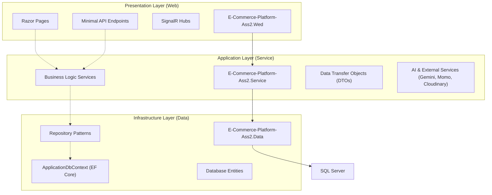

# E-Commerce Platform Ass2


## Overview

This project is a robust, feature-rich e-commerce platform built using modern Web technologies. It follows a clean 3-layer architecture to ensure scalability, maintainability, and clear separation of concerns.

## Key Features

- **AI Personal Shopper**: Integrated AI service (via Gemini) to assist users with product recommendations and queries.
- **Payment Integration**: Supports multiple payment gateways including Momo and VNPT eKYC for secure transactions.
- **Real-time Notifications**: Uses SignalR for live updates and chat functionality.
- **Background Jobs**: Automated tasks like AI chat fallback workers to ensure system reliability.
- **Comprehensive Management**: Admin and Shop management interfaces for overseeing products, orders, and reviews.

## Technology Stack

- **Framework**: .NET Core 9.0 (ASP.NET Core Razor Pages)
- **Database**: SQL Server with Entity Framework Core
- **Real-time**: SignalR
- **AI**: Google Gemini API
- **Payments**: Momo API, VNPT eKYC
- **Cloud Services**: Cloudinary for image management

## System Architecture

The system is designed with a standard 3-layer architecture:



### Layer Descriptions

1.  **Presentation Layer (`E-Commerce-Platform-Ass2.Wed`)**:
    - Handles the user interface using Razor Pages.
    - Manages real-time communication via SignalR Hubs (Notification, Chat).
    - Provides Minimal API endpoints for specific AI features.
    - Handles authentication and authorization.

2.  **Application/Service Layer (`E-Commerce-Platform-Ass2.Service`)**:
    - Contains the core business logic of the application.
    - Integrates with external APIs (Gemini for AI, Momo for payments).
    - Handles data mapping between entities and DTOs.
    - Contains background workers for asynchronous tasks.

3.  **Infrastructure/Data Layer (`E-Commerce-Platform-Ass2.Data`)**:
    - Manages data persistence using Entity Framework Core.
    - Implements the Repository pattern for data access abstraction.
    - Defines the database schema and entities.
    - Handles database migrations.

## Getting Started

1.  Configure the `appsettings.json` in the `Wed` project with your connection strings and API keys.
2.  Apply migrations using `dotnet ef database update`.
3.  Run the project using `dotnet run`.

## 1. Kiến trúc tổng thể

Hệ thống được xây dựng theo mô hình phân tầng (Layered Architecture):

- **UI Layer (E-Commerce-Platform-Ass2.Wed):**
  - Giao diện người dùng sử dụng Razor Pages, xử lý request/response, xác thực, phân quyền, session, layout, component, static files.
  - Kết nối SignalR Hub để nhận/gửi thông báo real-time.
  - Giao tiếp với tầng Service để lấy dữ liệu, thực hiện nghiệp vụ.
- **Service Layer (E-Commerce-Platform-Ass2.Service):**
  - Chứa toàn bộ business logic, xử lý nghiệp vụ (quản lý sản phẩm, đơn hàng, ví, đánh giá, đổi trả, ...).
  - Định nghĩa các DTO, helper, validate dữ liệu, mapping giữa entity và DTO.
  - Giao tiếp với tầng Repository để truy xuất dữ liệu.
  - Tích hợp các dịch vụ ngoài (Momo, Cloudinary, VNPT eKYC) qua các service chuyên biệt.
- **Repository/Data Layer (E-Commerce-Platform-Ass2.Data):**
  - Chứa các entity, repository, migration, context, truy vấn dữ liệu với Entity Framework Core.
  - Đảm nhiệm lưu trữ, truy xuất, cập nhật dữ liệu từ SQL Server.

## 2. Chức năng chính theo vai trò

### Khách hàng (Customer)

- Đăng ký, xác thực email, đăng nhập, cập nhật hồ sơ
- Duyệt, tìm kiếm, lọc, xem chi tiết sản phẩm
- Thêm vào giỏ hàng, đặt hàng, thanh toán qua ví hoặc Momo
- Quản lý đơn hàng, đổi trả, đánh giá sản phẩm
- Đặt trước (Pre-order) sản phẩm bằng cơ chế đặt cọc và thanh toán phần còn lại
- Quản lý ví cá nhân, xem lịch sử giao dịch

### Chủ shop (Seller)

- Đăng ký shop, cập nhật thông tin shop
- Quản lý sản phẩm (CRUD, phân trang, lọc, tìm kiếm)
- Quản lý đơn hàng, xác nhận/trả hàng, xử lý đổi trả
- Thống kê doanh thu, sản phẩm bán chạy
- Quản lý ví shop, rút tiền, xem lịch sử giao dịch
- Quản lý danh sách đơn đặt trước, xác nhận hàng về để mở thanh toán phần còn lại
- Nhận thông báo real-time (SignalR)

### Quản trị viên (Admin)

- Quản lý người dùng, shop, sản phẩm, đơn hàng
- Phê duyệt shop/sản phẩm, khóa/mở tài khoản
- Thống kê toàn hệ thống, xuất báo cáo

## 3. Tích hợp & Bảo mật

- **Thanh toán:** Momo, ví nội bộ
- **Lưu trữ ảnh:** Cloudinary
- **eKYC:** VNPT xác thực danh tính
- **Thông báo:** SignalR real-time (Microsoft)
- **Bảo mật:** Xác thực cookie, phân quyền vai trò, session, bảo vệ route nhạy cảm

## 4. Cơ sở dữ liệu

- SQL Server, script `seed-data.sql` khởi tạo dữ liệu mẫu (admin, seller, customer, sản phẩm, đơn hàng...)

## 5. Quy trình hoạt động chính

1. **Khách hàng sử dụng AI Personal Shopper:**
   - Đăng nhập → Gửi yêu cầu tư vấn cá nhân (AI Personal Shopper) → Nhận gợi ý sản phẩm/combo → Thêm combo vào giỏ → Đặt hàng → Thanh toán

2. **Khách hàng:**
   - Đăng nhập → Duyệt sản phẩm → Thêm vào giỏ → Đặt hàng → Thanh toán → Xem/trả hàng → Đánh giá

3. **Chủ shop:**
   - Đăng nhập → Đăng ký shop → Thêm sản phẩm → Quản lý đơn → Xử lý đổi trả → Thống kê doanh thu

4. **Admin:**
   - Đăng nhập → Quản lý/phê duyệt → Thống kê → Báo cáo

5. **Khách hàng + Chủ shop (luồng mới): Đặt trước sản phẩm có đặt cọc (Pre-order)**
   - **Shop:** Tạo sản phẩm/biến thể trạng thái `PreOrder` + cấu hình tỷ lệ cọc + ngày dự kiến có hàng + số lượng nhận đặt trước tối đa
   - **Customer:** Chọn biến thể pre-order → thanh toán cọc (Wallet/Momo)
   - **Hệ thống:** Tạo đơn trạng thái `DEPOSIT_PAID` và gửi thông báo real-time cho customer + shop
   - **Shop:** Xác nhận hàng đã về → đơn chuyển `READY_FOR_FINAL_PAYMENT`
   - **Customer:** Thanh toán phần còn lại trong thời hạn
   - **Hệ thống:** Chuyển đơn sang luồng giao hàng chuẩn (`PROCESSING` → `SHIPPING` → `DELIVERED`) hoặc `EXPIRED` nếu quá hạn

### 5.1 Blueprint kỹ thuật cho luồng Pre-order

1. **Trạng thái đơn bổ sung**
   - `DEPOSIT_PENDING`: Đã tạo yêu cầu đặt trước, chờ thanh toán cọc
   - `DEPOSIT_PAID`: Đã thanh toán cọc thành công
   - `READY_FOR_FINAL_PAYMENT`: Shop xác nhận có hàng, chờ khách thanh toán phần còn lại
   - `EXPIRED`: Quá hạn thanh toán phần còn lại

2. **Đề xuất DTO**
   - `CreatePreOrderRequest`:
     - `VariantId`, `Quantity`, `DepositPercent`, `ExpectedAvailableDate`
   - `PayPreOrderDepositRequest`:
     - `PreOrderId`, `PaymentMethod`
   - `FinalizePreOrderPaymentRequest`:
     - `PreOrderId`, `PaymentMethod`
   - `PreOrderStatusDto`:
     - `PreOrderId`, `Status`, `DepositAmount`, `RemainingAmount`, `FinalPaymentDeadline`

3. **Đề xuất API**
   - `POST /Api/PreOrder/Create`
   - `POST /Api/PreOrder/PayDeposit`
   - `POST /Api/PreOrder/MarkReadyForFinalPayment` (Shop)
   - `POST /Api/PreOrder/PayRemaining`
   - `GET /Api/PreOrder/MyOrders` (Customer)
   - `GET /Api/Shop/PreOrders` (Shop)

4. **Realtime events (SignalR)**
   - `PreOrderCreated`
   - `PreOrderReadyForFinalPayment`
   - `PreOrderPaymentCompleted`
   - `PreOrderExpired`

5. **Rule nghiệp vụ quan trọng**
   - Không cho tạo pre-order nếu vượt `pre-order max quantity`
   - Không cho thanh toán phần còn lại khi chưa ở trạng thái `READY_FOR_FINAL_PAYMENT`
   - Tự động chuyển `EXPIRED` khi quá hạn thanh toán phần còn lại
   - Chính sách hoàn/khấu trừ cọc cần cấu hình theo shop hoặc policy hệ thống

### 5.2 Thiết kế CSDL & Entity chi tiết cho Pre-order

#### A. Định hướng tương thích hệ thống hiện tại

- Hệ thống đang dùng bảng `orders`, `order_items`, `payments` làm xương sống giao dịch.
- Để hạn chế refactor lớn, Pre-order sẽ bám theo `orders` (không tạo đơn hàng song song), và thêm bảng metadata cho pre-order.
- Lưu ý quan trọng: cấu hình hiện tại của `payments` đang unique theo `OrderId` (mỗi order chỉ có 1 payment). Luồng cọc + thanh toán phần còn lại bắt buộc phải hỗ trợ nhiều payment cho 1 order.

#### B. Thay đổi schema đề xuất

1. **Mở rộng bảng orders**
   - Thêm cột `OrderType` (nvarchar(30), default: `Normal`): `Normal`, `PreOrder`
   - Thêm cột `FinalPaymentDueAt` (datetime, nullable)
   - Thêm cột `PreOrderStatus` (nvarchar(50), nullable) để tách trạng thái pre-order khỏi trạng thái fulfillment

2. **Tạo bảng preorder_details**
   - `Id` (PK, Guid)
   - `OrderId` (FK -> orders.Id, unique)
   - `ShopId` (FK -> shops.Id)
   - `ExpectedAvailableDate` (datetime, not null)
   - `DepositPercent` (decimal(5,2), not null)
   - `DepositAmount` (decimal(18,2), not null)
   - `RemainingAmount` (decimal(18,2), not null)
   - `FinalPaymentDeadlineHours` (int, not null, default 48)
   - `ActivatedFinalPaymentAt` (datetime, nullable)
   - `ExpiredAt` (datetime, nullable)
   - `CreatedAt` (datetime, default GETDATE())
   - `UpdatedAt` (datetime, nullable)

3. **Tạo bảng preorder_policy_items** (cấu hình theo biến thể)
   - `Id` (PK, Guid)
   - `ProductVariantId` (FK -> product_variants.Id, unique)
   - `AllowPreOrder` (bit, default 0)
   - `DepositPercent` (decimal(5,2), nullable)
   - `MaxPreOrderQty` (int, nullable)
   - `LeadTimeDays` (int, nullable)
   - `Status` (nvarchar(30), default `Active`)
   - `CreatedAt` (datetime, default GETDATE())
   - `UpdatedAt` (datetime, nullable)

4. **Điều chỉnh bảng payments**
   - Bỏ unique index `IX_payments_OrderId`
   - Đổi sang non-unique index `IX_payments_OrderId`
   - Thêm cột `PaymentStage` (nvarchar(30), not null, default `FULL`): `DEPOSIT`, `FINAL`, `FULL`

#### C. Entity đề xuất (Data layer)

1. **Order (bổ sung)**
   - `OrderType`, `PreOrderStatus`, `FinalPaymentDueAt`
   - Navigation: `PreOrderDetail? PreOrderDetail`

2. **Payment (bổ sung)**
   - `PaymentStage`
   - Quan hệ đổi từ one-to-one sang one-to-many với `Order`

3. **PreOrderDetail (entity mới)**
   - 1-1 với `Order`
   - N-1 với `Shop`

4. **PreOrderPolicyItem (entity mới)**
   - 1-1 theo `ProductVariant`

#### D. Ràng buộc dữ liệu (constraints)

1. Check constraints
   - `DepositPercent BETWEEN 1 AND 100`
   - `DepositAmount >= 0`, `RemainingAmount >= 0`
   - `MaxPreOrderQty > 0` nếu khác null
   - `PaymentStage IN ('DEPOSIT','FINAL','FULL')`

2. Quy tắc tổng tiền
   - `DepositAmount + RemainingAmount = TotalAmount` tại thời điểm tạo pre-order

3. Quy tắc trạng thái
   - Không cho insert `FINAL` payment nếu `PreOrderStatus <> READY_FOR_FINAL_PAYMENT`

#### E. Indexes hiệu năng

1. `orders(OrderType, PreOrderStatus, CreatedAt DESC)`
2. `preorder_details(ShopId, CreatedAt DESC)`
3. `preorder_details(ExpectedAvailableDate)`
4. `payments(OrderId, PaymentStage, PaidAt DESC)`
5. `preorder_policy_items(ProductVariantId, Status)`

#### F. Kế hoạch migration theo phase (an toàn)

1. **Phase 1 - Schema additive (không phá vỡ luồng cũ)**
   - Thêm bảng `preorder_details`, `preorder_policy_items`
   - Thêm cột mới vào `orders`, `payments`
   - Giữ code checkout hiện tại chạy bình thường

2. **Phase 2 - Payment model switch**
   - Đổi mapping `Payment` từ one-to-one thành one-to-many với `Order`
   - Bỏ unique index `payments.OrderId`
   - Bổ sung service logic tạo 2 payment stage cho pre-order

3. **Phase 3 - Business enforcement**
   - Thêm validation pre-order policy theo variant
   - Thêm job hết hạn (`EXPIRED`) theo `FinalPaymentDueAt`
   - Bổ sung realtime events cho customer/shop

#### G. Kịch bản dữ liệu mẫu (happy path)

1. Create pre-order order:
   - `orders.OrderType = PreOrder`
   - `orders.PreOrderStatus = DEPOSIT_PENDING`

2. Pay deposit:
   - Insert `payments` với `PaymentStage = DEPOSIT`
   - Update `orders.PreOrderStatus = DEPOSIT_PAID`

3. Shop mark ready:
   - Update `orders.PreOrderStatus = READY_FOR_FINAL_PAYMENT`
   - Set `orders.FinalPaymentDueAt = now + 48h`

4. Pay remaining:
   - Insert `payments` với `PaymentStage = FINAL`
   - Update `orders.Status = Paid` (hoặc trạng thái fulfillment tương đương)
   - Update `orders.PreOrderStatus = COMPLETED`

## 6. Sơ đồ các tầng layer hệ thống

```mermaid
graph TD
    UI[UI (Razor Pages, SignalR, Static Files)]
    Controller[PageModel/Controller Layer]
    Service[Service Layer (Business Logic, DTOs, Helper)]
    Repository[Repository Layer (EF Core, Query, CRUD)]
    Database[(SQL Server Database)]
    External[External Services (Momo, Cloudinary, VNPT eKYC)]

    UI --> Controller
    Controller --> Service
    Service --> Repository
    Repository --> Database
    Service -- Gọi API --> External
    UI -- Real-time --> UI
```

## 7. Thư mục chính

- `/E-Commerce-Platform-Ass2.Data`: Entity, Repository, Migration
- `/E-Commerce-Platform-Ass2.Service`: Service, DTO, Helper, Business Logic
- `/E-Commerce-Platform-Ass2.Wed`: Razor Pages, UI, Hubs, Pages, wwwroot

## 8. Hướng dẫn sử dụng nhanh

1. Chạy script `seed-data.sql` trên SQL Server
2. Sửa `appsettings.json` cho đúng chuỗi kết nối
3. Build & chạy:
   ```
   dotnet build
   dotnet run --project E-Commerce-Platform-Ass2.Wed
   ```
4. Truy cập: http://localhost:5232

## 9. Tài khoản mẫu

- **Admin**: admin@example.com / 123456
- **Seller**: seller1@example.com / 123456
- **Customer**: customer1@example.com / 123456

---
